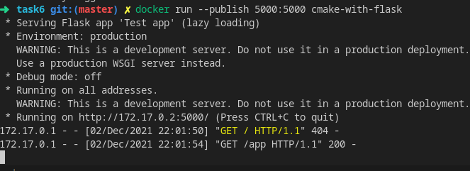
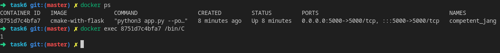

# Assigment 4. Docker

## Part 1. cmake-with-flask
```bash
docker build . -t cmake-with-flask
docker run --publish 5000:5000 cmake-with-flask
```
After the second line it will show a link like on a picture below</br>

</br>Open link in browser and add `/app` to the pass. `ok` should be shown on a page.</br>
To verify that cmake binary created do:
```bash
docker ps
docker exec CONTAINER_ID /bin/C
```
</br>
Output should be 1:</br>



## Part 2. Spring-Boot App
```bash
docker-compose down -v
docker-compose build
docker-compose up
```
**Note**: Because server requires integration testing, so database container should be build and initialized with tables, so I use script from https://github.com/ufoscout/docker-compose-wait to wait database initilization.</br>

**KNOWN ISSUE**: Correspindig to [insturctions](https://docs.google.com/document/d/1RmHK3CN8yC2n3HbKmk-bYpPKTXaGblvV0PcU9TBS-y8/edit), there should be a new page availiable. Despite the fact, that MySQL database is created in container and integration tests are sucessfully passed, only title page is availiable, there should be some incorrect behaviour in Java part.
